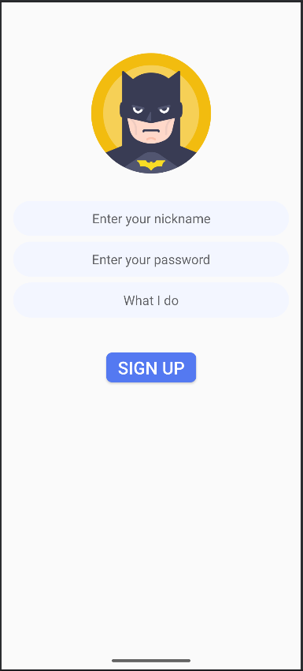

# Messenger Android Application

## Overview

This project is a **simple messenger application** for Android, enabling users to:

- **Sign Up** with username, password, and role/position.
- **Sign In** with username and password.
- **Update profile** including username (unique), role, and profile picture.
- **Search for users** to start chats.
- **Send text messages** in chats.
- **Search among existing chats** for quick access.

The application leverages **Firebase** to store user data, authentication tokens, profile pictures, and related information.

---

## Features

### 🔐 Authentication

- **Sign Up**
    - Requires:
        - Unique username
        - Password
        - Role/position
    - Stores user data in Firebase.

- **Sign In**
    - Requires:
        - Username
        - Password
    - Retrieves user token and data from Firebase.

---

### 👤 Profile Management

- Users can:
    - **Update username** (must remain unique).
    - **Update role/position**.
    - **Update profile picture**.
- All updates are reflected in Firebase storage and user data.

---

### 💬 Messaging

- Users can:
    - **Search for other users** by pressing the ➕ (plus) button to initiate chats.
    - **Send text messages only** (no images, videos, or files in current implementation).
    - **View previous chats** and search within them for quick navigation.

---

### 🔎 Search Functionality

- **Global Search (➕ button)**: Find all registered users.
- **Chats Search**: Find users with whom you have existing chats.

---

## Screenshots

  
  
  
  
  
  
  

---

## Technologies Used

- **Android**
    - Kotlin
    - XML-based layouts
    - Fragments
    - ViewModels (MVVM architecture)
- **Firebase**
    - Authentication
    - Firestore / Realtime Database
    - Storage (profile pictures)

---

## Limitations

- Only text messages are supported.
- No group chat functionality.
- No image/video/file sending within chats yet.

---
